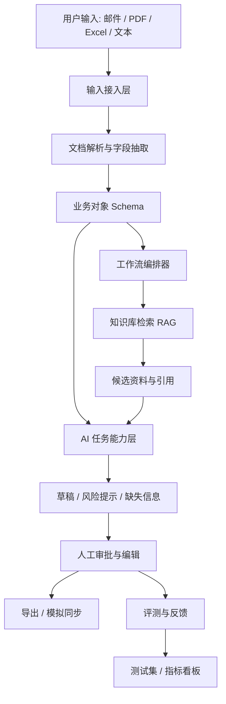

# 垂直行业 AI 工作流系统：技术可行性分析与 Demo 架构设计

日期：2026-06-22

关联文档：[AI 应用方向创业计划初稿](./ai-startup-plan.md)

## 1. 研究目标

本文档用于在正式创业或产品开发前，回答三个问题：

1. 这套“垂直行业 AI 工作流系统”的想法是否能够落地？
2. 落地过程中有哪些技术、数据、产品和交付困难，是否有办法解决？
3. 如何设计一个能跑的 Demo，用来验证共性能力，而不是过早绑定某一个行业？

这里讨论的系统不是“让 AI 去点击企业现有系统界面”的 RPA/GUI 自动化工具，而是一套新的行业工作流系统。它把 AI 嵌入企业流程中，完成信息抽取、知识检索、候选匹配、草稿生成、风险提示、人工审批和结果导出，再通过 API、文件导入导出、插件或轻量连接器与企业现有系统同步。

## 2. 初步结论

技术上可行，但前提是控制边界。

早期不应做：

- 不训练基础模型。
- 不做全自动决策。
- 不做通用 Agent 平台。
- 不做以 GUI 点击为主的 RPA Agent。
- 不深度接入复杂 ERP/MES/医院系统。
- 不承诺 AI 自动报价、自动诊断、自动合规判断。

早期应做：

- 用成熟大模型 API 或可替换模型接口。
- 用结构化 Schema 约束输出。
- 用 RAG 和引用来源降低幻觉。
- 用确定性工作流包住 AI。
- 用人工审批控制业务风险。
- 用行业配置包适配不同行业。
- 用小规模真实/脱敏样本验证效果。

核心判断：

> 这套系统的难点不是“能不能调用大模型”，而是能不能把行业流程、数据结构、知识库、人工审批和评测机制组织成一个稳定的业务系统。

## 3. 行业无关的共性流程

无论是制造外贸、宠物门店、跨境运营、法律服务、教育咨询，很多 AI 工作流都可以抽象成同一套模式。

### 通用业务流

1. 接收输入：邮件、聊天记录、PDF、Excel、图片、表单、网页、系统导出文件。
2. 解析内容：抽取关键字段、识别业务对象、切分文档、保留来源。
3. 归一化数据：把非结构化内容转成统一 Schema。
4. 检索知识：从产品资料、历史案例、FAQ、报价、规则、合同模板中检索相关信息。
5. 生成候选结果：生成回复、报价草稿、服务建议、风险提示、下一步动作。
6. 人工审核：业务人员确认、修改、驳回或补充信息。
7. 输出结果：生成邮件、报价单、任务、提醒、报告或服务记录。
8. 同步留痕：保存版本、引用、审批记录，并可同步到外部系统。
9. 评测改进：对输出准确率、人工修改量、耗时、失败原因做持续评估。

### 不同行业的映射

| 共性流程 | 制造/外贸 | 宠物门店 | 跨境运营 |
|---|---|---|---|
| 输入 | 询盘邮件、规格书、报价单 | 微信咨询、预约、宠物档案 | 商品资料、评论、广告数据 |
| 结构化 | 型号、数量、认证、交期 | 服务项目、时间、宠物信息 | SKU、卖点、关键词、平台规则 |
| 检索 | 产品库、历史报价、技术资料 | 价格表、服务 SOP、会员记录 | Listing、竞品、评论、平台规则 |
| 生成 | 报价草稿、澄清问题、英文回复 | 客服回复、预约确认、复购提醒 | 标题、脚本、广告文案 |
| 审批 | 销售/主管确认 | 店员/店长确认 | 运营/主管确认 |
| 输出 | 邮件、报价单、CRM 跟进 | 预约、私域消息、服务记录 | Listing、短视频脚本、广告方案 |

## 4. 共性组件设计

### 4.1 输入与数据接入层

目标：让系统能接收多种业务输入。

第一版支持：

- 文本粘贴。
- 文件上传：PDF、Excel、Word、图片。
- 邮件样本导入：eml、txt、复制粘贴。
- CSV/Excel 产品库或服务项目表。
- 手动录入业务对象。

后续支持：

- 邮箱连接器。
- 企业微信/飞书连接器。
- CRM/ERP API。
- 网页表单。
- 行业 SaaS 系统导入。

技术难点：

- 文件格式复杂。
- 表格结构不统一。
- PDF 可能是扫描件。
- 邮件线程包含历史引用和签名。

解决思路：

- Demo 阶段优先支持可控格式。
- PDF/Excel/文本解析先做 80% 场景。
- 扫描件 OCR 可作为可选能力。
- 所有解析结果保留原文片段和来源位置。

### 4.2 文档解析与结构化抽取层

目标：把非结构化输入转成业务对象。

核心能力：

- 文本抽取。
- 表格抽取。
- 字段识别。
- 多语言内容识别。
- 输出 JSON Schema。
- 字段置信度。
- 缺失字段提示。

示例业务对象：

```json
{
  "request_type": "quote_request",
  "customer_country": "Germany",
  "product_name": "stainless steel valve",
  "quantity": 500,
  "requirements": ["CE certification", "delivery within 30 days"],
  "missing_fields": ["pressure rating", "material grade"],
  "source_refs": ["email:paragraph_2", "attachment:table_1"]
}
```

技术可行性：

- 用大模型结构化输出 + JSON Schema 校验，可以完成第一版字段抽取。
- 对关键字段增加正则、字典、枚举和业务规则校验。
- 对低置信度字段要求人工确认。

主要风险：

- 同义词、行业术语和非标准表达较多。
- 模型可能把未出现的信息补全。
- 表格跨页、合并单元格、扫描件识别不稳定。

应对方式：

- 输出必须带引用来源。
- 缺失信息必须标记为 missing，不允许臆测。
- 关键字段采用“模型抽取 + 规则校验 + 人工确认”三段式。

### 4.3 行业知识库与 RAG 层

目标：让系统能基于企业自己的资料生成答案，而不是只靠模型常识。

知识类型：

- 产品资料。
- 服务价格表。
- FAQ。
- 历史报价。
- 历史案例。
- SOP。
- 合同/邮件模板。
- 平台规则。
- 审批规则。

基础能力：

- 文档切分。
- 元数据标记。
- 向量检索。
- 关键词检索。
- 混合检索。
- 引用展示。
- 资料版本管理。

技术可行性：

- Demo 阶段可以用轻量向量库或数据库插件实现。
- 小规模数据下，混合检索 + rerank 可满足演示。
- 行业术语多时，应加入关键词、字段过滤和手动标签。

主要风险：

- 单纯向量检索容易召回相似但不正确的资料。
- 企业资料中可能存在冲突版本。
- 产品型号、规格和价格需要精确匹配，不能只靠语义相似。

应对方式：

- 结构化字段检索优先，语义检索辅助。
- 资料必须有版本、来源和生效时间。
- 报价、库存、价格等高风险数据不由 AI 直接决定，只做参考和提示。

### 4.4 工作流编排层

目标：让系统按照确定步骤完成业务任务，而不是让模型自由发挥。

第一版采用确定性工作流：

1. 创建任务。
2. 解析输入。
3. 抽取字段。
4. 检索相关资料。
5. 生成候选结果。
6. 风险检查。
7. 人工审批。
8. 导出/同步。
9. 记录评测数据。

为什么不用完全自主 Agent：

- 早期稳定性不足。
- 企业客户难以信任。
- 失败原因难排查。
- 成本和耗时不可控。

更合理的方式：

- 工作流由系统控制。
- 每一步有输入、输出和校验。
- 大模型只负责特定子任务。
- 高风险步骤必须人工审批。

### 4.5 AI 任务能力层

系统需要多个“小 AI 能力”，而不是一个大而全的 Agent。

| 能力 | 作用 | 风险等级 |
|---|---|---|
| 分类器 | 判断输入类型、任务类型、优先级 | 低 |
| 字段抽取器 | 抽取业务字段 | 中 |
| 匹配器 | 匹配产品、服务、案例、规则 | 中 |
| 草稿生成器 | 生成邮件、报价说明、客服回复 | 中 |
| 风险检查器 | 发现缺失参数、过度承诺、冲突信息 | 高 |
| 评分器 | 给输出质量和置信度打分 | 中 |
| 总结器 | 生成摘要、跟进记录 | 低 |

关键原则：

- 每个 AI 能力都有明确输入输出。
- 输出必须可校验。
- 高风险输出必须带引用和人工确认。
- 不把复杂业务决策交给单次模型调用。

### 4.6 人工审批与协同层

目标：让 AI 成为业务人员的工作台，而不是黑箱自动化。

第一版需要：

- AI 结果预览。
- 来源引用展示。
- 缺失字段提示。
- 风险提示。
- 人工编辑。
- 通过/驳回。
- 审批记录。
- 版本对比。

这部分是企业客户信任系统的关键。没有人工审批，早期产品很难进入真实业务。

### 4.7 输出与轻集成层

第一版输出方式：

- 复制文本。
- 导出 Word/PDF/Excel。
- 生成邮件草稿。
- 下载结构化 JSON/CSV。
- 生成跟进任务。

后续集成方式：

- 邮箱发送草稿。
- CRM 线索/商机同步。
- 企业微信/飞书消息推送。
- ERP 报价单导入。
- 行业 SaaS API。

原则：

- Demo 阶段先做导出和模拟同步。
- POC 阶段再做 1-2 个客户强需求集成。
- 避免一开始陷入复杂系统集成。

### 4.8 评测与反馈层

目标：证明系统真的有效，而不是只看演示效果。

评测对象：

- 字段抽取准确率。
- 检索命中率。
- 草稿可用率。
- 风险识别能力。
- 人工修改量。
- 任务处理耗时。
- 成本。
- 用户采纳率。

反馈机制：

- 用户修改后的结果保存为参考样本。
- 用户驳回原因分类。
- 每次生成记录 prompt、模型、引用、输入和输出。
- 定期回放测试集，观察回归。

## 5. Demo 架构设计

### 5.1 Demo 目标

Demo 要验证共性能力，不追求行业完整性。

必须能跑通：

1. 上传或输入一条业务请求。
2. 系统抽取结构化字段。
3. 系统从知识库检索相关资料。
4. 系统生成业务草稿。
5. 系统提示风险和缺失信息。
6. 用户人工确认或修改。
7. 系统导出结果。
8. 系统记录评测数据。

### 5.2 Demo 架构图



### 5.3 建议技术架构

第一版可以采用单体应用 + 后台任务的方式，不需要微服务。

| 层 | 建议实现 |
|---|---|
| 前端 | Web 工作台，包含任务列表、详情页、引用面板、审批面板 |
| 后端 API | 负责任务、文件、知识库、工作流、用户操作 |
| 任务队列 | 处理文件解析、embedding、模型调用、评测 |
| 数据库 | 存业务对象、任务、审批、日志、评测结果 |
| 文件存储 | 存上传文件、解析结果、导出文件 |
| 向量检索 | 存知识库切片和 embedding |
| 模型网关 | 封装不同大模型、embedding、rerank 能力 |
| 评测模块 | 管理测试集、标准答案、自动评分和人工评分 |

### 5.4 行业配置包

为了证明系统具备跨行业共性，Demo 应设计“行业配置包”。

每个行业配置包包含：

```yaml
industry: manufacturing_export
entities:
  - inquiry
  - product
  - quote
  - customer
schemas:
  inquiry:
    fields:
      - product_name
      - quantity
      - delivery_time
      - certification
      - missing_fields
workflow:
  - classify_request
  - extract_fields
  - retrieve_knowledge
  - generate_draft
  - risk_check
  - human_approval
templates:
  - quote_reply_email
  - clarification_questions
risk_rules:
  - no_price_commit_without_approval
  - no_delivery_commit_without_inventory_check
eval:
  - field_extraction_accuracy
  - draft_usability
  - risk_detection
```

这样可以用同一个系统壳，加载不同配置：

- manufacturing_export：制造业出口询盘-报价。
- pet_store：宠物门店客服-预约-复购。
- cross_border_content：跨境商品内容-评论分析-Listing。

Demo 阶段建议先做一个主配置包，再做一个极简第二行业配置包，用来证明架构可迁移。

## 6. Demo 范围定义

### 6.1 第一版 Demo 推荐场景

推荐优先做：

> 制造业出口询盘-报价 Demo

原因：

- 和主线商业方向一致。
- 数据结构有代表性。
- 能体现字段抽取、RAG、匹配、生成、审批、导出等共性能力。
- 价值容易被客户理解。

### 6.2 最小样本数据

Demo 数据包：

| 数据 | 数量 | 说明 |
|---|---:|---|
| 询盘样本 | 20 条 | 可模拟，也可来自脱敏客户数据 |
| 产品资料 | 20-50 条 | 产品名称、规格、参数、应用场景 |
| 历史报价 | 10-30 条 | 价格可脱敏或区间化 |
| 邮件模板 | 3-5 个 | 报价回复、澄清问题、跟进邮件 |
| 风险规则 | 5-10 条 | 价格、交期、认证、非标参数 |
| 标准答案 | 10-20 条 | 用于字段抽取和草稿评测 |

### 6.3 无企业内部数据时的数据启动方案

当前没有企业内部数据时，可以用“公开资料 + 规则合成 + 人工标注”的方式构造第一版制造业出口询盘-报价 Demo 数据包。

这套数据不能证明真实报价准确，但可以验证系统链路：

> 询盘输入 -> 字段抽取 -> 产品/资料检索 -> 风险提示 -> 回复草稿 -> 人工审批 -> 导出 -> 评测记录。

#### 推荐默认品类

第一版建议选择：

> 工业阀门出口询盘-报价

可覆盖的产品包括：

- stainless steel ball valve
- butterfly valve
- check valve
- gate valve
- solenoid valve
- flange / fitting

选择这个品类的原因：

1. 公开产品资料多。
2. 参数结构清晰，例如材质、尺寸、压力等级、连接方式、认证、MOQ、交期。
3. 询盘场景容易构造。
4. 风险规则典型，例如缺少压力等级、交期过短、认证缺失、非标材料。
5. 不需要复杂图纸和工艺计算就能做第一版 Demo。

备选品类：

- 工业水泵。
- 紧固件。
- 五金工具。
- LED 灯具。
- 包装材料。

不建议第一版选择：

- 高度非标设备。
- 需要复杂图纸报价的机械系统。
- 医疗器械。
- 化工品。
- 强监管产品。

#### 数据来源

第一版数据来源分四类。

| 来源 | 用法 | 注意事项 |
|---|---|---|
| 公开产品手册/官网产品页 | 整理产品资料、规格、参数、认证、应用场景 | 手工整理少量样本即可，不做大规模抓取 |
| 公开采购/RFQ 资料 | 学习需求表达、采购字段、交付条款 | 只用于模拟询盘语言，不冒充真实客户 |
| 合成询盘和报价 | 构造可控测试集 | 全部标注 synthetic |
| 人工标注标准答案 | 评测字段抽取、检索命中、风险识别 | 至少人工复核 20 条 |

可参考的公开资料入口：

- [SAM.gov Contract Opportunities API](https://open.gsa.gov/api/get-opportunities-public-api/)：美国政府采购机会 API，可用于参考 solicitation/RFQ 的字段、标题、分类、截止日期和附件链接。该 API 需要 API key，不作为第一天的阻塞依赖。
- [TED CSV 数据集](https://data.europa.eu/data/datasets/ted-csv?locale=en)：欧盟公开采购公告数据，可用于参考采购需求和招标表达。
- 公开制造商官网、产品 PDF、B2B 平台公开商品页：用于手工整理少量产品规格。Demo 阶段不建议做自动化批量抓取。

#### 第一版数据包目标

建议第一版数据包规模：

| 数据 | 数量 | 生成方式 |
|---|---:|---|
| 产品/SKU | 30 条 | 从公开资料手工整理 + 少量合成 |
| 产品知识文档 | 30-50 段 | 每个产品 1-2 段说明 |
| 合成询盘 | 60 条 | 按模板和规则生成 |
| 合成历史报价 | 30 条 | 根据 SKU、数量、地区、交期规则生成 |
| 邮件模板 | 5 个 | 人工编写 |
| 风险规则 | 10 条 | 人工编写 |
| 字段抽取标准答案 | 30 条 | 人工标注或复核 |
| 检索标准答案 | 20 条 | 人工指定应命中的产品/资料 |

#### 建议目录结构

```text
sample-data/
  manufacturing_export/
    README.md
    products/
      products.csv
      product_docs.md
    inquiries/
      synthetic_inquiries.jsonl
    quotes/
      synthetic_history_quotes.csv
    templates/
      email_templates.md
    rules/
      risk_rules.yaml
    eval/
      gold_field_extraction.jsonl
      gold_retrieval.jsonl
      gold_risk_flags.jsonl
```

#### 产品数据 Schema

`products.csv` 建议字段：

```csv
product_id,product_name,category,material,size_range,pressure_rating,connection_type,certifications,moq,standard_lead_time_days,price_band_usd,notes,source_type,source_url
SV-BV-100,Stainless Steel Ball Valve,ball_valve,SS304,DN15-DN50,PN16,threaded,CE,100,20,8-18,standard model,synthetic,
SV-BV-200,Stainless Steel Ball Valve,ball_valve,SS316,DN25-DN100,PN25,flanged,CE;RoHS,50,30,25-60,corrosion resistant,synthetic,
```

要求：

- `source_type` 必须区分 `public_manual`、`public_page`、`synthetic`。
- 如果来自公开资料，应记录 `source_url`。
- 合成数据不要冒充真实厂商、真实报价或真实客户。

#### 询盘数据 Schema

`synthetic_inquiries.jsonl` 每行一条：

```json
{
  "inquiry_id": "INQ-SYN-001",
  "language": "en",
  "customer_country": "Germany",
  "channel": "email",
  "subject": "Inquiry for stainless steel ball valves",
  "body": "Hi, we need 500 pcs stainless steel ball valves with CE certification. Please quote your best price and confirm whether delivery within 15 days is possible.",
  "expected_fields": {
    "product_name": "stainless steel ball valve",
    "quantity": 500,
    "certification": "CE",
    "requested_delivery_days": 15,
    "missing_fields": ["size", "material grade", "pressure rating", "connection type"]
  },
  "expected_risk_flags": ["missing_required_specs", "delivery_shorter_than_standard"],
  "synthetic": true
}
```

询盘需要覆盖这些类型：

1. 信息完整的标准询盘。
2. 缺少尺寸/材质/压力等级的询盘。
3. 要求紧急交付的询盘。
4. 要求认证但产品资料不支持的询盘。
5. 小于 MOQ 的询盘。
6. 多产品询盘。
7. 多语言询盘，例如英文、西语、阿语。
8. 低质量询盘，例如只问 best price。
9. 带附件说明的询盘。
10. 明显需要人工升级的非标询盘。

#### 历史报价数据 Schema

`synthetic_history_quotes.csv` 建议字段：

```csv
quote_id,date,customer_region,product_id,quantity,unit_price_band_usd,lead_time_days,trade_term,result,notes,synthetic
Q-SYN-001,2026-01-15,EU,SV-BV-100,500,9-14,22,FOB,won,standard CE request,true
Q-SYN-002,2026-02-08,Middle East,SV-BV-200,80,30-48,35,CIF,lost,customer requested shorter lead time,true
```

报价数据第一版只用于“相似案例检索”和“草稿参考”，不用于自动计算最终价格。

#### 风险规则 Schema

`risk_rules.yaml` 示例：

```yaml
rules:
  - id: missing_required_specs
    description: Product size, material grade, pressure rating, and connection type are required before quotation.
    severity: high
    action: ask_clarification

  - id: delivery_shorter_than_standard
    description: If requested delivery days are shorter than product standard lead time, do not commit delivery date.
    severity: high
    action: require_human_approval

  - id: certification_not_supported
    description: If requested certification is not listed in product certifications, flag risk and ask for confirmation.
    severity: high
    action: require_human_approval

  - id: quantity_below_moq
    description: If requested quantity is below MOQ, quote must be manually confirmed.
    severity: medium
    action: require_human_approval
```

#### 邮件模板

至少准备 5 类模板：

1. 标准报价回复。
2. 缺参数澄清问题。
3. 交期需要确认。
4. 认证需要确认。
5. 跟进邮件。

模板要求：

- 英文为主。
- 语气专业但不承诺最终价格和交期。
- 明确哪些内容需要人工确认。

#### 合成询盘生成 Prompt

可以用大模型按以下 Prompt 批量生成询盘，但生成后必须人工抽查和修正。

```text
你是 B2B 制造业外贸数据集构造助手。
请基于以下产品表和风险规则，生成 20 条英文客户询盘邮件。

要求：
1. 每条询盘必须是 synthetic，不要使用真实公司名、真实联系人、真实电话或真实邮箱。
2. 覆盖完整询盘、缺失尺寸、缺失材质、紧急交期、认证要求、低于 MOQ、多产品询盘、低质量询盘等情况。
3. 每条询盘输出 JSON，包含 inquiry_id、subject、body、expected_fields、expected_risk_flags。
4. expected_fields 必须只包含询盘正文中明确出现的信息；没有出现的字段放到 missing_fields。
5. 不要生成最终报价。

产品表：
{products}

风险规则：
{risk_rules}
```

#### 标准答案构造

不要把全部标准答案都交给模型自动生成。建议：

1. 用模型生成初稿。
2. 人工复核 30 条字段抽取标准答案。
3. 人工指定 20 条询盘应该命中的产品或资料。
4. 人工确认 20 条询盘的风险标签。

评测集必须和开发调试集分开：

- `dev`：40 条询盘，用于调试。
- `eval`：20 条询盘，用于评测，不在调试时反复修改。

#### 3 天启动计划

第 1 天：品类和产品包。

- 确定工业阀门作为品类。
- 手工整理 30 个 SKU。
- 写 30-50 段产品知识文档。
- 写 10 条风险规则。

第 2 天：询盘和报价包。

- 合成 60 条询盘。
- 合成 30 条历史报价。
- 写 5 个邮件模板。
- 给所有数据加 `synthetic` 标记。

第 3 天：评测包。

- 人工复核 30 条字段标准答案。
- 人工标注 20 条检索标准答案。
- 人工标注 20 条风险标签。
- 形成 `dev/eval` 切分。
- 用这套数据跑第一版 Demo。

#### 数据质量检查

生成后必须检查：

1. 是否所有合成数据都标注 `synthetic: true`。
2. 是否没有真实公司名、联系人、手机号、邮箱。
3. 产品字段是否足够结构化。
4. 每条询盘是否至少有一个可评测目标。
5. 风险规则是否能覆盖一部分询盘。
6. 标准答案是否只基于询盘和产品资料，不凭空补充。
7. 价格是否使用区间或模拟值，不冒充真实市场报价。
8. Demo 展示时是否明确说明“该数据包用于验证流程，不代表真实报价”。

#### 客户演示时的说法

对潜在客户演示时，应主动说明：

> 当前 Demo 使用公开资料和合成数据，目的是验证流程能力，包括字段抽取、资料检索、风险提示、草稿生成和人工审批。真实报价准确性需要基于贵司脱敏询盘、产品资料和历史报价做第二阶段验证。

这个说法可以降低客户对“模拟数据不真实”的质疑，同时把下一步自然导向客户数据 Demo。

### 6.4 Demo 用户流程

1. 用户上传一封英文询盘邮件和一个产品资料表。
2. 系统识别这是一条报价请求。
3. 系统抽取客户国家、产品、数量、交期、认证要求。
4. 系统发现缺失字段，例如材料等级、尺寸、包装方式。
5. 系统检索相似产品和历史报价。
6. 系统生成英文回复草稿和澄清问题。
7. 系统提示风险，例如“不能承诺 15 天交付，需要人工确认”。
8. 用户修改并点击通过。
9. 系统导出邮件草稿和报价草稿。
10. 系统记录本次任务耗时、引用资料、模型输出和人工修改。

### 6.5 Demo 不做的事情

第一版 Demo 不做：

- 用户登录和复杂权限。
- 多租户。
- 真实邮件收发。
- 真实 CRM/ERP 写入。
- 复杂审批流。
- 大规模知识库。
- 自动价格决策。
- 自主多步 Agent。
- 模型训练。

## 7. 技术可行性问题与解决方案

### 问题一：字段抽取是否可靠？

判断：可做，但不能裸用模型输出。

解决方案：

- 使用结构化输出。
- 使用 JSON Schema 校验。
- 字段加类型、枚举、单位和必填规则。
- 对低置信度字段提示人工确认。
- 输出带原文引用。

Demo 验证：

- 准备 20 条询盘。
- 人工标注标准答案。
- 计算核心字段准确率。

### 问题二：知识库检索是否准确？

判断：可做，但需要结构化检索和语义检索结合。

解决方案：

- 产品型号、规格、价格等精确字段用结构化查询。
- 说明书、FAQ、案例用向量检索。
- 加入关键词检索和 rerank。
- 所有回答展示引用资料。

Demo 验证：

- 对每条询盘人工指定应召回资料。
- 统计 Top-K 命中率。
- 检查引用是否支持生成内容。

### 问题三：AI 生成草稿是否能被业务人员使用？

判断：能生成初稿，但必须限定为草稿。

解决方案：

- 使用企业模板。
- 明确禁止承诺价格、交期、认证等高风险内容。
- 对缺失信息生成澄清问题。
- 生成内容分区：可发送内容、内部风险提示、待确认信息。

Demo 验证：

- 让业务人员评价草稿是否可改后发送。
- 统计人工修改比例和节省时间。

### 问题四：如何避免 AI 胡编？

判断：不能完全避免，但可以工程上降低风险。

解决方案：

- 只允许基于引用资料回答关键事实。
- 缺资料时必须输出“无法确认”。
- 风险检查器二次审查输出。
- 高风险字段必须人工审批。
- 记录引用和版本。

Demo 验证：

- 构造缺失信息、冲突资料、诱导问题。
- 检查系统是否拒绝臆测或提示人工确认。

### 问题五：跨行业是否可复用？

判断：底层架构可复用，行业配置和数据模型不可完全复用。

可复用部分：

- 文件接入。
- 文档解析。
- Schema 抽取框架。
- RAG 管线。
- 工作流引擎。
- 审批界面。
- 日志和评测。
- 模型网关。

不可直接复用部分：

- 行业字段。
- 业务规则。
- 输出模板。
- 风险规则。
- 评测标准。
- 客户系统集成。

解决方案：

- 架构上做配置化。
- 商业上先聚焦一个行业。
- 不一开始追求多行业平台。

### 问题六：客户数据安全怎么处理？

判断：早期必须前置，否则客户不愿提供样本。

解决方案：

- Demo 数据脱敏。
- 不使用客户数据训练模型。
- 明确数据使用范围。
- 本地或私有云部署可作为 POC 选项。
- 保留访问日志和删除机制。

Demo 验证：

- 提供脱敏模板。
- 提供样本数据使用说明。
- 支持一键删除客户样本。

## 8. Demo 成功标准

技术成功标准：

| 指标 | 目标 |
|---|---|
| 文件解析 | 能处理文本、PDF、Excel 中至少 2 类 |
| 字段抽取 | 核心字段准确率达到 80% 左右 |
| 检索命中 | Top-3 能找到相关资料 |
| 草稿生成 | 业务人员愿意基于草稿修改 |
| 风险提示 | 能识别关键缺失字段和过度承诺 |
| 引用展示 | 关键结论能追溯到资料 |
| 人工审批 | 用户能修改、通过、导出 |
| 评测记录 | 能保存输入、输出、引用、修改和评分 |

业务成功标准：

| 指标 | 目标 |
|---|---|
| 客户理解 | 5 分钟内能看懂系统解决什么问题 |
| 演示转化 | 看完 Demo 后愿意提供脱敏样本 |
| POC 意愿 | 至少 1-2 家愿意讨论付费 POC |
| 效率感知 | 客户认为能节省 30% 以上处理时间 |
| 信任感 | 客户认可“AI 草稿 + 人工审批 + 引用来源”的模式 |

## 9. 建议开发里程碑

### 第 1 周：Demo 骨架

目标：

- Web 页面。
- 文件上传。
- 任务列表。
- 任务详情。
- 简单字段抽取。
- 模型调用封装。

交付：

- 可以输入一段询盘文本。
- 可以看到结构化字段。

### 第 2 周：知识库与生成

目标：

- 产品资料导入。
- 知识库检索。
- 引用展示。
- 邮件草稿生成。
- 风险提示。

交付：

- 可以上传询盘，生成带引用的回复草稿。

### 第 3 周：人工审批与导出

目标：

- 人工编辑。
- 通过/驳回。
- 版本记录。
- 导出邮件/报价草稿。
- 基础日志。

交付：

- 可以完整跑通“输入-生成-审批-导出”流程。

### 第 4 周：评测与第二行业配置验证

目标：

- 测试集。
- 标准答案。
- 字段准确率统计。
- 草稿评分。
- 一个极简第二行业配置包。

交付：

- 有可量化评测报告。
- 能证明架构不是一次性脚本。

## 10. 推荐目录结构

如果后续要开始实现 Demo，可以采用如下结构：

```text
ai-workflow-demo/
  apps/
    web/
    api/
  packages/
    workflow/
    model-gateway/
    document-parser/
    retrieval/
    evaluation/
    industry-config/
  data/
    sample/
      manufacturing_export/
      pet_store/
    eval/
  docs/
    architecture.md
    data-requirements.md
    demo-script.md
```

也可以先做更轻的单仓单应用：

```text
demo/
  src/
    pages/
    api/
    workflows/
    ai/
    retrieval/
    parsers/
    eval/
    configs/
  sample-data/
  docs/
```

第一版优先简单，不要为未来平台化过度设计。

## 11. 主要风险清单

| 风险 | 严重程度 | 应对 |
|---|---|---|
| 客户数据拿不到 | 高 | 先用模拟数据做概念 Demo，再用 NDA 换脱敏样本 |
| 字段抽取不稳定 | 中高 | Schema 校验、规则辅助、人工确认 |
| 检索召回错误 | 中高 | 混合检索、元数据过滤、引用展示 |
| 生成内容胡编 | 高 | 引用约束、风险检查、人工审批 |
| 行业差异过大 | 中 | 架构复用，业务配置行业化 |
| Demo 变成定制项目 | 中 | 限定 Demo 范围，明确不做深集成 |
| 客户只觉得好玩不付费 | 高 | 用真实效率指标和 POC 收费验证 |
| 集成成本失控 | 高 | 先导出/导入，后轻集成，最后再 API |

## 12. 下一步行动

建议下一步按这个顺序推进：

1. 确定第一个 Demo 场景，建议选择制造业出口询盘-报价。
2. 准备一套模拟数据包，包括询盘、产品资料、历史报价和模板。
3. 定义第一个行业配置包。
4. 画低保真页面原型：任务列表、任务详情、引用面板、审批面板。
5. 实现最小可跑流程。
6. 用测试集评测字段抽取、检索和草稿生成。
7. 找 3-5 个潜在客户演示，换取脱敏真实样本。
8. 基于真实样本迭代 Demo，再判断是否进入付费 POC。

## 13. 暂定结论

这套系统具备技术可行性，但要坚持三个边界：

1. 产品上做“新行业工作流系统”，不是“AI 点击旧系统”。
2. 技术上做“确定性流程 + AI 子能力”，不是“完全自主 Agent”。
3. 商业上先验证一个行业场景，不一开始做通用平台。

如果 Demo 能证明以下三点，就值得继续：

- AI 能稳定完成字段抽取、检索、草稿生成和风险提示。
- 业务人员愿意在人工审批模式下使用。
- 潜在客户愿意提供脱敏样本或讨论付费 POC。

如果这三点不能同时成立，应优先调整行业场景、数据输入或产品切口，而不是继续扩大技术范围。
